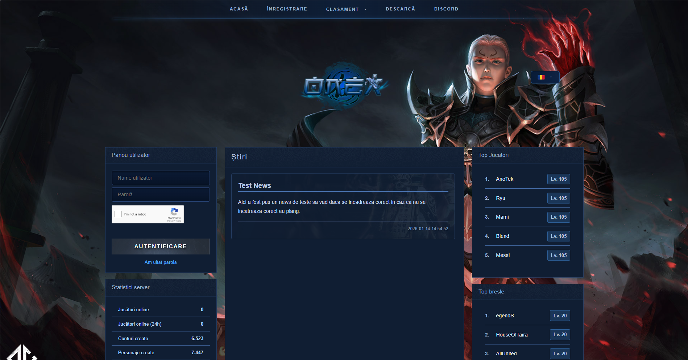
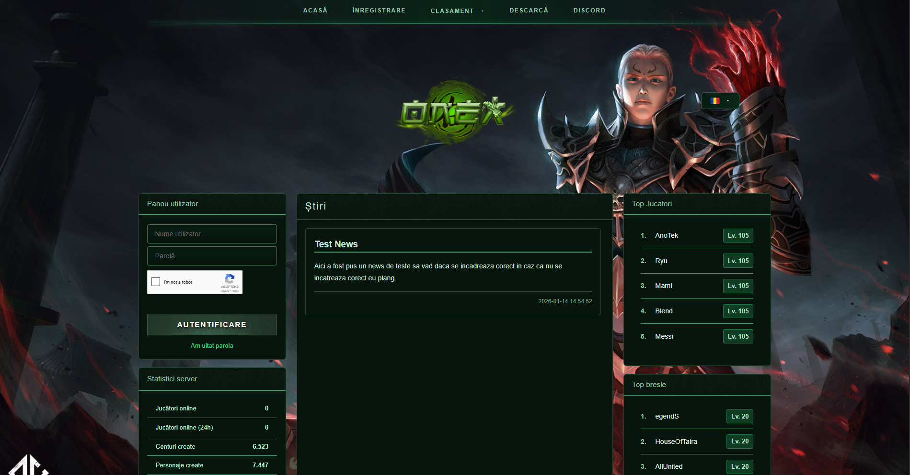
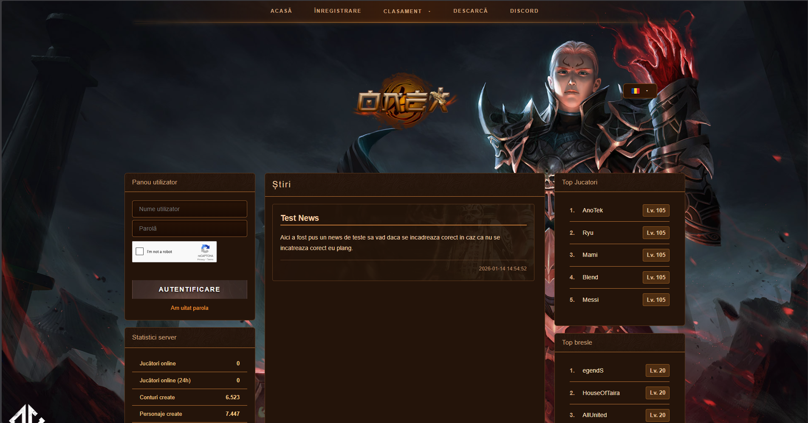
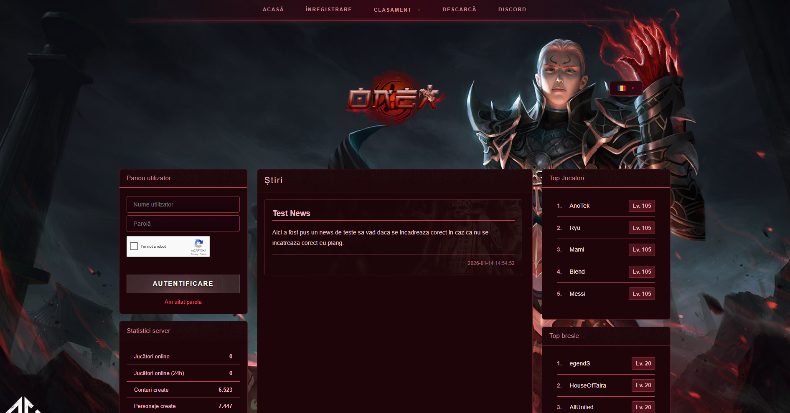

# Metin PHP Website (PHP 8+)
---

> 📢 **Vrei să contribui cu teme noi?**
> Dacă ai idei de design și vrei să creezi teme pentru acest site, te poți alătura proiectului!
> Contactează-mă pe Discord la: **onexro**
> Toate temele acceptate vor fi adăugate în repo cu numele autorului 💙


## ✨ Caracteristici principale

- ✅ Login & Register
- ✅ Download client
- ✅ Știri / News
- ✅ Ranking:
  - Top jucători
  - Top bresle
- ✅ Recuperare parolă
- ✅ User Panel
- ✅ Admin Panel
- ✅ Sistem de teme (4 teme incluse: **albastru, verde, portocaliu, roșu**)

---

## 🛡️ Securitate

Aplicația este construită cu securitatea în prim-plan:

- ✅ Protecție XSS în JavaScript și CKEditor  
- ✅ Sesiuni sigure cu **HttpOnly**, **Secure**, **SameSite**
- ✅ **CSRF tokens** pentru toate formularele importante
- ✅ Protecție la **SQL injection** prin **PDO** (prepared statements)
- ✅ **Rate limiting** strict:
- ✅ **Security headers** (CSP, X-Frame-Options, etc.)
- ✅ **HTML sanitizer**

---

## 🧩 Modul de teme

Proiectul vine cu **4 teme de bază**:

- 🔵 Albastru  
- 🟢 Verde  
- 🟠 Portocaliu  
- 🔴 Roșu  

Tema se poate schimba foarte ușor din fișierul de configurare, de exemplu:

```php
// config.php (exemplu)
return [
    'theme' => 'blue', // valori posibile: blue, green, orange, red
];
```
## 🖼️ Screenshots / Demo teme

### Tema Albastru


### Tema Verde


### Tema Portocaliu


### Tema Roșu
